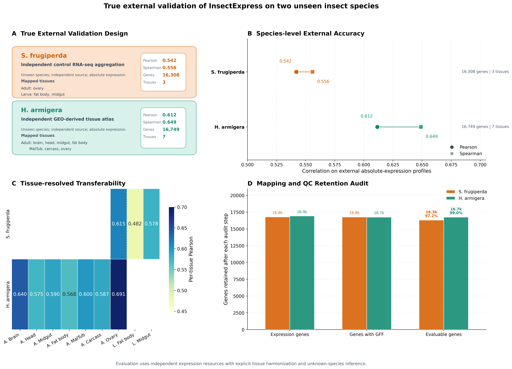
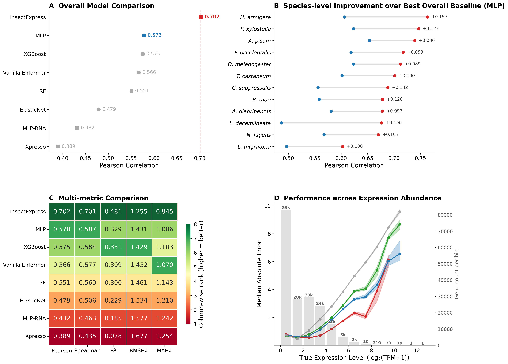

# InsectExpress

InsectExpress is a multimodal framework for cross-species prediction of tissue-resolved gene expression in insects.

This repository is the English public companion release for the InsectExpress manuscript and includes the released model checkpoint, processed paper-facing data tables, exported figures, supplementary tables, and figure-generation scripts.

## Highlights

- Multimodal prediction from promoter-centered DNA sequence, RNA stability features, and ESM-derived protein representations
- Tissue-resolved modeling across 14 standardized tissues
- Cross-species benchmark spanning 12 insect species
- Released paper-facing external validation package for `Spodoptera frugiperda` and `Helicoverpa armigera`
- Companion package with manuscript, figures, benchmark summaries, and released checkpoint

## Preview

<div align="center">
  
  
</div>

## Quick links

- Manuscript: `manuscript/InsectExpress_manuscript.docx`
- Main checkpoint: `models/insectexpress_seed42_checkpoint.pt`
- Main paper figures: `results/paper/figures/`
- Supplementary tables: `results/paper/Table_S1_species_genome_info.csv` to `results/paper/Table_S4_model_hyperparameters.csv`
- External validation release: `results/external_validation_true/`
- Figure scripts: `scripts/paper/`
- Figure reproduction guide: `docs/reproduce_main_figures.md`
- GitHub about metadata template: `docs/github_about_metadata.md`
- Release notes: `docs/release_notes_v1.md`

## Repository layout

- `manuscript/`
  - manuscript files used in the release snapshot
- `scripts/paper/`
  - figure-generation scripts and shared evaluation helpers
- `data/processed/`
  - released aligned expression matrices in standardized tissue space
- `models/`
  - released pretrained checkpoint
- `results/paper/`
  - paper tables and exported main/supplementary figures
- `results/enformer_v2/`
  - selected released summaries for the main model and multi-seed analyses
- `results/external_validation_true/`
  - released external-validation outputs
- `docs/`
  - repository notes and release documentation

## Scope of this release

This GitHub repository is a processed-data and paper-assets release. It does not include the full raw-data acquisition pipeline, raw genome archives, raw RNA-seq reads, or the largest intermediate tensors generated during interpretability analysis.

Intentionally excluded assets include:

- raw sequencing inputs and genome assemblies
- very large internal attention or interpretability tensors
- temporary intermediate bundles not required to inspect the released figures
- unrelated lethality-project assets

## Software environment

The released scripts and paper assets were prepared in the following environment:

- Python 3.10.12
- PyTorch 2.7.1+cu118
- scikit-learn 1.7.2
- XGBoost 3.1.1
- NumPy 1.26.4
- pandas 2.3.3
- matplotlib 3.10.7
- seaborn 0.13.2

See `requirements.txt` for the pinned package versions used in this release snapshot.

## Reproducing released figures

The scripts in `scripts/paper/` are intended to regenerate the released paper figures from the exported processed tables and result files included in this repository. Most scripts write outputs into `results/paper/figures/` relative to the repository root.

Example:

```bash
python scripts/paper/plot_fig6_ism_interpretability.py
python scripts/paper/plot_fig_external_validation_true.py
```

A figure-by-figure command guide is provided in `docs/reproduce_main_figures.md`.

## Citation

GitHub citation metadata is provided in `CITATION.cff`.

If you use this repository, please cite:

```text
InsectExpress: multimodal cross-species prediction of tissue-resolved gene expression in insects.
GitHub repository: https://github.com/hjd20030114-blip/InsectExpress
```

## License

This repository currently uses a research-release license with all rights reserved unless a future revision replaces it. See `LICENSE`.

## Notes

- All public file and directory names in this repository use English naming.
- This repository is focused on the InsectExpress expression-prediction project only.
